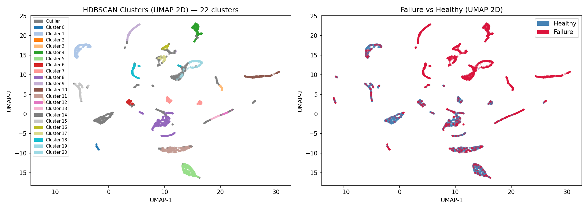
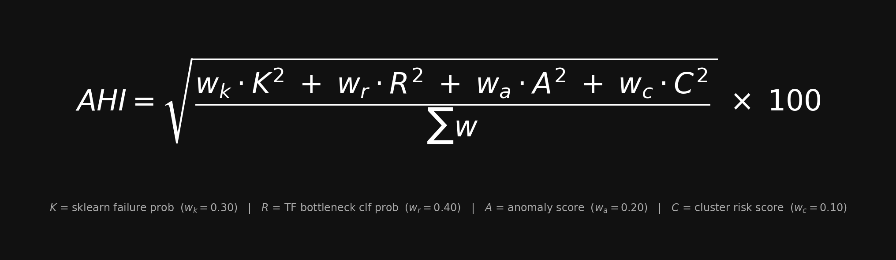

<div align="center">

<br/>


**Hard drive failure assessment & Aggregated Health Index — 4 ML components fused into one current-state verdict.**

[](frontend/)
[](backend/)
[](srcML/tensorflow_classification/)
[](srcML/sklearn/)
[](docker-compose.yaml)

</div>

## Authors

**Luka Petek**

---

## About the Project

A machine learning system for assessing the current condition of hard drives from **SMART** sensor data. Four model components — spanning supervised learning, unsupervised anomaly detection, and density-based clustering — are fused into a single interpretable score: the **Aggregated Health Index (AHI)**. The bottleneck classifier and HDBSCAN share the same encoder, so the components are not independent.

Built on the [Backblaze 2025](https://www.backblaze.com/cloud-storage/resources/hard-drive-test-data) open dataset: **32M+ records**, **365 daily CSV files**, **4,414 confirmed failure events**.

> **For a detailed ML engineering breakdown** — preprocessing logic, model architectures, training configs, and AHI fusion math — see [`srcML/README.md`](srcML/README.md).

- **Four ML components, one final score** — RF, deep AE, bottleneck classifier and HDBSCAN are combined into one AHI verdict while their individual scores remain visible
- **32M+ real-world sensor records** — trained on Backblaze production fleet data, not synthetic benchmarks
- **Local evaluation** — upload a `smartctl -j` JSON output and receive an AHI score and verdict without a remote service
- **Fully offline** — no cloud, no telemetry, no data leaves the machine

*The model evaluates the current condition of a drive and outputs an AHI risk index from 0 to 100 points. It does not predict future failure or estimate remaining drive life.*

---

## Model Components

| Component | Method | Representation | AHI Weight |
|---|---|---|---:|
| **Model 0** — Random Forest | Supervised Random Forest | 19 processed SMART features + manufacturer encoding | 0.30 |
| **Model 1** — Anomaly AE | Healthy-only autoencoder | 19 features → 12-dimensional bottleneck | 0.20 |
| **Model 2** — Bottleneck classifier | Supervised classifier | 19 features → shared 8-dimensional encoder | 0.40 |
| **Model 3** — HDBSCAN | Density-based clustering | Same shared 8-dimensional encoder | 0.10 |

The final evaluation compares all four components and AHI on the same serial-disjoint Q1 2026 records. The paper reports the resulting metrics and cohort counts.

---

## Project Structure

```
diskFailurePrediction/
│
├── srcML/                              # All ML code and trained artifacts
│   ├── sklearn/                        # Impl 0 — Random Forest pipeline
│   │   ├── disk_pipeline.py            #   Preprocessing + DiskHealthPipeline class
│   │   ├── disk_health_pipeline.pkl    #   Serialized trained pipeline
│   │   └── smart_scan_model.ipynb      #   Training notebook (RF + regression analysis)
│   ├── tensorflow_anomaly/             # Impl 1 — Unsupervised autoencoder
│   │   ├── train_autoencoder.py        #   Training script (healthy-only)
│   │   ├── predict_autoencoder.py      #   Single-disk inference
│   │   ├── disk_autoencoder.keras      #   Trained model
│   │   ├── tf_scaler.pkl               #   Fitted MinMaxScaler
│   │   ├── tf_metadata.json            #   Threshold + evaluation metrics
│   │   └── logs/                       #   TensorBoard training logs
│   ├── tensorflow_classification/      # Impl 2 — Bottleneck classifier (2-stage)
│   │   ├── train_autoencoder.py        #   Stage 1: train feature extractor AE
│   │   ├── train_bottleneck_classifier.py  # Stage 2: train supervised classifier
│   │   ├── predict_bottleneck.py       #   Single-disk inference
│   │   ├── disk_clf_encoder.keras      #   Encoder artifact (shared with clustering)
│   │   ├── disk_bottleneck_classifier.keras
│   │   ├── clf_scaler.pkl
│   │   ├── bottleneck_metadata.json    #   Thresholds + evaluation metrics
│   │   └── logs/                       #   TensorBoard training logs
│   ├── tensorflow_clustering/          # Impl C — UMAP + HDBSCAN
│   │   ├── umap_hdbscan.py             #   Training + TensorBoard Projector export
│   │   ├── clf_hdbscan.pkl             #   Trained HDBSCAN model
│   │   ├── hdbscan_metadata.json       #   18 clusters + per-cluster failure rates
│   │   └── logs/                       #   TensorBoard Embedding Projector logs
│   ├── nn_preprocessing/
│   │   └── preprocessing.py            #   Shared feature prep, CSV loading, dataset balancing
│   └── ahi_final.py                    #   ★ Final AHI scoring — combines all 4 models
│
├── backend/                            # FastAPI inference server
├── frontend/                           # React + Vite dashboard
├── DiskJson/                           # Example smartctl JSON inputs for testing
├── Graphs/                             # All evaluation plots (auto-generated)
├── csv/                                # Prepared datasets (vseOdpovedi.csv — all 4,414 failures)
└── docker-compose.yaml                 # backend + frontend + TensorBoard (port 6006)
```

---

### Dashboard

Score clamped to **[3, 97]** · Verdicts: **HEALTHY** < 45 · **WARNING** 45–65 · **CRITICAL** > 65


---

## Model 0 — Random Forest (Sklearn)

A classical supervised pipeline trained in [`smart_scan_model.ipynb`](srcML/sklearn/smart_scan_model.ipynb) on 19 SMART attributes plus manufacturer encoding. Serves as a strong and interpretable baseline.

**Top failure predictors by feature importance:**
1. SMART 5 — Reallocated Sectors Count
2. SMART 187 — Reported Uncorrectable Errors
3. SMART 188 — Command Timeout
4. SMART 197 — Current Pending Sector Count

The RF uses serial-grouped train/test splitting. Final component metrics are reported from the common Q1 2026 serial-disjoint evaluation rather than from this README.


---

## Model 1 — Autoencoder Anomaly Detection (Unsupervised)

The autoencoder is trained **only on healthy disk rows**. It learns to reconstruct normal SMART patterns. When a disk with an unusual SMART pattern is evaluated, reconstruction error can rise above the learned 99th-percentile threshold. Failure rows are not used to train this autoencoder.

**Architecture:** 19 → 64 → 32 → **12** (bottleneck) → 32 → 64 → 19

The autoencoder's detailed validation metrics are stored in `tf_metadata.json`. For the final comparison, all components are scored on the same serial-disjoint Q1 2026 records.


```bash
python srcML/tensorflow_anomaly/train_autoencoder.py --data-dir DiskData
python srcML/tensorflow_anomaly/predict_autoencoder.py --input DiskJson/disk_data_sda.json
```

---

## Model 2 — Bottleneck Classifier (Supervised, 2-stage)

The strongest individual signal in the ensemble. A two-stage pipeline where a dedicated autoencoder first compresses the 19 SMART features into an **8-dimensional bottleneck** (optimal dimensionality determined empirically), and a supervised feedforward classifier then acts on those distilled, noise-reduced features.

Training uses a balanced labelled dataset and serial-grouped train/validation/test partitions, so records from the same drive do not cross the partitions. Final component metrics are reported from the common Q1 2026 serial-disjoint evaluation.


```bash
python srcML/tensorflow_classification/train_autoencoder.py --data-dir DiskData
python srcML/tensorflow_classification/train_bottleneck_classifier.py --data-dir DiskData
python srcML/tensorflow_classification/predict_bottleneck.py --input DiskJson/disk_data_sda.json
```

---

## Model 3 — UMAP + HDBSCAN Clustering (Unsupervised)

Density-based clustering directly on the **8-dim bottleneck representation** from Impl 2's encoder. UMAP reduces the space for visualization; HDBSCAN clusters in the full 8-dim space without requiring a pre-specified cluster count.

HDBSCAN is fitted on the training serials in the 8-dimensional encoder space. Each cluster receives an empirical failure rate from the training labels, and held-out records are assigned with `approximate_predict`. UMAP is used only for visualization. Cluster risks are index components, not fleet failure probabilities.



```bash
python srcML/tensorflow_clustering/umap_hdbscan.py --data-dir DiskData
```

---

## Aggregated Health Index (AHI) - Clean and final result

All four models are fused into a single score using a **weighted root-mean-square** formula. RMS is preferred over a linear average because it amplifies large individual signals — a disk that looks catastrophic on one axis cannot be "averaged away" by healthy scores elsewhere.



| Symbol | Source | Weight |
|---|---|---|
| K | Sklearn RF failure probability | 0.30 |
| R | TF Bottleneck Classifier probability | **0.40** |
| A | Anomaly AE normalized score | 0.20 |
| C | HDBSCAN cluster failure rate | 0.10 |

AHI is evaluated as a 0–100 index in points, not as a calibrated failure probability. The primary external evaluation uses a balanced, serial-disjoint cohort from Q1 2026: failure-day records and healthy records from drives that did not fail during the quarter and were not present in the prepared 2025 training data. The evaluation script writes the per-record scores, component metrics, and plot to the `DiskJson/` and `Graphs/` directories. A small CPU test measured about 7.1 MB of model files and about 0.20 s to evaluate one disk, but TensorFlow used about 0.95 GB of memory during normal evaluation. NAS and edge-device performance has not been tested.

### Run on any disk:
```bash
# Export SMART data
smartctl -A -i /dev/sda -j > disk_data.json

# Score with all four models
python srcML/ahi_final.py --input disk_data.json
```

### Example output:
```json
{
  "ahi_score": 33.43,
  "verdict": "HEALTHY",
  "components": {
    "sklearn_failure_prob": 0.2106,
    "tf_clf_failure_prob": 0.4286,
    "anomaly_score": 0.0,
    "cluster_risk_score": 0.133
  }
}
```

---

## API & Frontend

The **FastAPI backend** exposes `/api/predict/combined`, which runs all four models and returns the fused AHI verdict — this is the endpoint the **React/Vite dashboard** calls when you upload a scan. A legacy `/api/analyze-smart-json` alias (sklearn-only) is kept for backward compatibility.

```bash
curl -X POST http://localhost:8000/api/predict/combined \
  -F "file=@disk_data.json;type=application/json"
```

```json
{
  "disk_health_score": 33.43,
  "verdict": "HEALTHY",
  "confidence": "high",
  "model_scores": { "tf_classification": {...}, "tf_anomaly": {...}, "clustering": {...}, "sklearn": {...} },
  "consensus": { "models_predicting_failure": 0, "models_total": 4 }
}
```

---

## TensorBoard

All three NN training runs log to their respective `logs/` directories. A dedicated TensorBoard container is included in `docker-compose.yaml` with named log streams:

```bash
docker compose up          # starts backend + frontend + tensorboard
# → http://localhost:6006  (anomaly / classification / clustering tabs)
```

Available views: **Scalars** (loss, AUC per epoch) · **Histograms** (weight distributions) · **Graphs** (model topology) · **Projector** (clustering: 8-dim bottleneck embeddings colored by cluster and failure label)

---

## Stack

`TensorFlow / Keras` · `scikit-learn` · `UMAP-learn` · `HDBSCAN` · `FastAPI` · `React + Vite` · `Docker`

---
