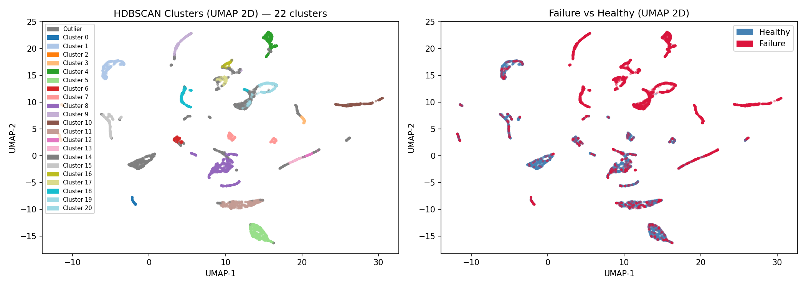
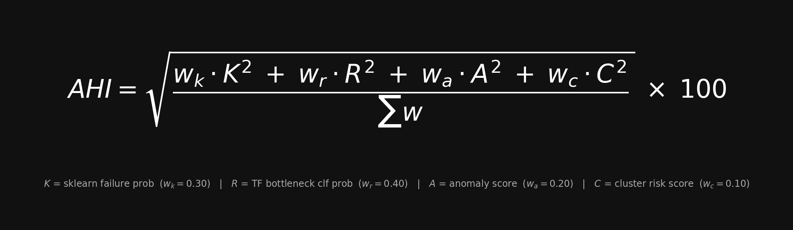

<div align="center">

<br/>


**Hard drive failure assessment & Aggregated Health Index — 4 ML components fused into one current-state verdict.**

[](frontend/)
[](backend/)
[](srcML/tensorflow_classification/)
[](srcML/sklearn/)
[](docker-compose.yaml)

</div>

## Authors

**Luka Petek**

**Published on IJS IS conference:** https://aile3.ijs.si/dunja/SiKDD2026/Papers/IS_2026_paper__97.pdf

---

## About the Project

A machine learning system for assessing the current condition of hard drives from **SMART** sensor data. Four model components — spanning supervised learning, unsupervised anomaly detection, and density-based clustering — are fused into a single interpretable score: the **Aggregated Health Index (AHI)**. The bottleneck classifier and HDBSCAN share the same encoder, so the components are not independent.

The source corpus is the [Backblaze hard-drive dataset](https://www.backblaze.com/cloud-storage/resources/hard-drive-test-data): more than **32 million daily records** from **365 CSV files**, prepared for the period from 1 October 2024 to 30 September 2025. It contains **4,414 failure-day records**. The complete source corpus is not passed to every model: the healthy-only autoencoders use sampled healthy records, while supervised training and clustering use a balanced labelled set.

> **For a detailed ML engineering breakdown** — preprocessing logic, model architectures, training configs, and AHI fusion math — see [`srcML/README.md`](srcML/README.md).

- **Four ML components, one final score** — random forest, anomaly autoencoder, bottleneck classifier and HDBSCAN are combined while their individual scores remain visible
- **Real SMART data** — models are trained on prepared samples from the Backblaze source corpus, not synthetic records
- **Local evaluation** — upload a `smartctl -j` JSON file and receive an AHI score and verdict
- **Fully offline inference** — no cloud or remote inference service is required

*AHI describes how failure-like the current SMART snapshot is. It is a risk index, not a calibrated failure probability, future-failure prediction, or remaining-life estimate.*

---

## Training Data and Model Components

| Component | Training data | Representation | AHI weight |
|---|---|---|---:|
| **Random forest** | Balanced: 4,414 failure-day + 4,414 healthy records | 19 processed features + manufacturer encoding | 0.30 |
| **Anomaly autoencoder** | 289,982 healthy train + 72,481 healthy validation records | 19 features → 12-dimensional bottleneck | 0.20 |
| **Bottleneck classifier** | Encoder trained on healthy records; classifier trained on the balanced 8,828-record set | 19 features → shared 8-dimensional encoder → dense classifier | 0.40 |
| **HDBSCAN** | Balanced 8,828-record set with serial-grouped internal split | Same shared 8-dimensional encoder | 0.10 |

The 8-dimensional bottleneck was selected in a preliminary sweep over 4, 6, 7, 8, 10 and 12 dimensions. Eight had the highest validation ROC-AUC in that experiment. The sweep used a reduced sample and did not compare against the unreduced 19-dimensional input, so 8 should not be treated as a universally optimal dimension.

## Q1 2026 Evaluation

The paper reports a common evaluation on **2,036 serial-disjoint records** from Q1 2026: **1,018 failure-day records and 1,018 healthy records**. Every component and AHI was scored on the same balanced cohort. Training serial numbers were excluded before evaluation.

| Score | ROC-AUC | PR-AUC | Recall | FPR | Precision | F1 |
|---|---:|---:|---:|---:|---:|---:|
| Random forest | 0.922 | **0.938** | 0.812 | 0.067 | **0.924** | **0.865** |
| Bottleneck classifier | 0.906 | 0.912 | 0.772 | 0.086 | 0.899 | 0.831 |
| Anomaly detector | 0.737 | 0.742 | 0.522 | **0.064** | 0.891 | 0.658 |
| HDBSCAN cluster risk | 0.853 | 0.816 | **0.820** | 0.227 | 0.783 | 0.801 |
| **AHI** | **0.923** | 0.936 | 0.783 | 0.091 | 0.896 | 0.835 |

AHI is evaluated as a continuous score against the binary `failure` label. ROC-AUC and PR-AUC measure ranking across thresholds. Recall, FPR, precision and F1 use the fixed binary decision `AHI >= 45` (Warning or Critical).

The balanced cohort is useful for comparing score separation, but it does not represent real fleet prevalence. In particular, the reported AHI precision of 0.896 must not be interpreted as expected production precision. With the same recall and FPR, the paper estimates precision of about 0.85%, 4.1% and 8.0% at failure prevalences of 0.1%, 0.5% and 1%, respectively.

The evaluation implementation is in [`srcML/evaluate_2026.py`](srcML/evaluate_2026.py), and the reported plot is in [`Graphs/ahi_2026.png`](Graphs/ahi_2026.png). The raw Q1 2026 CSV files and generated per-record metric CSV files are not tracked in this repository, so reproducing the reported table requires obtaining the source cohort first.

---

## Project Structure

```
diskFailurePrediction/
│
├── srcML/                              # All ML code and trained artifacts
│   ├── sklearn/                        # Impl 0 — Random Forest pipeline
│   │   ├── disk_pipeline.py            #   Preprocessing + DiskHealthPipeline class
│   │   ├── disk_health_pipeline.pkl    #   Serialized trained pipeline
│   │   └── smart_scan_model.ipynb      #   Training notebook (RF + regression analysis)
│   ├── tensorflow_anomaly/             # Impl 1 — Unsupervised autoencoder
│   │   ├── train_autoencoder.py        #   Training script (healthy-only)
│   │   ├── predict_autoencoder.py      #   Single-disk inference
│   │   ├── disk_autoencoder.keras      #   Trained model
│   │   ├── tf_scaler.pkl               #   Fitted MinMaxScaler
│   │   ├── tf_metadata.json            #   Threshold + evaluation metrics
│   │   └── logs/                       #   TensorBoard training logs
│   ├── tensorflow_classification/      # Impl 2 — Bottleneck classifier (2-stage)
│   │   ├── train_autoencoder.py        #   Stage 1: train feature extractor AE
│   │   ├── train_bottleneck_classifier.py  # Stage 2: train supervised classifier
│   │   ├── predict_bottleneck.py       #   Single-disk inference
│   │   ├── disk_clf_encoder.keras      #   Encoder artifact (shared with clustering)
│   │   ├── disk_bottleneck_classifier.keras
│   │   ├── clf_scaler.pkl
│   │   ├── bottleneck_metadata.json    #   Thresholds + evaluation metrics
│   │   └── logs/                       #   TensorBoard training logs
│   ├── tensorflow_clustering/          # Impl C — UMAP + HDBSCAN
│   │   ├── umap_hdbscan.py             #   Training + TensorBoard Projector export
│   │   ├── clf_hdbscan.pkl             #   Trained HDBSCAN model
│   │   ├── hdbscan_metadata.json       #   21 clusters + outlier group + risk metadata
│   │   └── logs/                       #   TensorBoard Embedding Projector logs
│   ├── nn_preprocessing/
│   │   └── preprocessing.py            #   Shared feature prep, CSV loading, dataset balancing
│   └── ahi_final.py                    #   ★ Final AHI scoring — combines all 4 models
│
├── backend/                            # FastAPI inference server
├── frontend/                           # React + Vite dashboard
├── DiskJson/                           # Example smartctl JSON inputs for testing
├── Graphs/                             # All evaluation plots (auto-generated)
├── csv/                                # Prepared datasets (vseOdpovedi.csv — all 4,414 failures)
└── docker-compose.yaml                 # backend + frontend + TensorBoard (port 6006)
```

---

### Dashboard

Score clamped to **[3, 97]** · Verdicts: **HEALTHY** < 45 · **WARNING** 45 to < 65 · **CRITICAL** ≥ 65


---

## Model 0 — Random Forest (Sklearn)

A classical supervised pipeline trained in [`smart_scan_model.ipynb`](srcML/sklearn/smart_scan_model.ipynb) on 19 SMART attributes plus manufacturer encoding. Serves as a strong and interpretable baseline.

**Top failure predictors by feature importance:**
1. SMART 5 — Reallocated Sectors Count
2. SMART 187 — Reported Uncorrectable Errors
3. SMART 188 — Command Timeout
4. SMART 197 — Current Pending Sector Count

The random forest uses serial-grouped train/test splitting. Its common Q1 2026 metrics are shown in the evaluation table above.


---

## Model 1 — Autoencoder Anomaly Detection (Unsupervised)

The autoencoder is trained **only on healthy disk rows**. It learns to reconstruct normal SMART patterns. When a disk with an unusual SMART pattern is evaluated, reconstruction error can rise above the learned 99th-percentile threshold. Failure rows are not used to train this autoencoder.

**Architecture:** 19 → 64 → 32 → **12** (bottleneck) → 32 → 64 → 19

The autoencoder's internal validation metrics are stored in `tf_metadata.json`. The common Q1 2026 table above is the direct comparison because every component is scored on the same records.


```bash
python srcML/tensorflow_anomaly/train_autoencoder.py --data-dir DiskData
python srcML/tensorflow_anomaly/predict_autoencoder.py --input DiskJson/disk_data_sda.json
```

---

## Model 2 — Bottleneck Classifier (Supervised, 2-stage)

A two-stage pipeline where a dedicated autoencoder first compresses the 19 SMART features into an **8-dimensional bottleneck**, and a supervised feedforward neural network then classifies that representation. Eight dimensions performed best by ROC-AUC among the sizes tested in the preliminary bottleneck sweep.

Training uses a balanced labelled dataset and serial-grouped train/validation/test partitions, so records from the same drive do not cross the partitions. The common Q1 2026 metrics are shown in the evaluation table above.


```bash
python srcML/tensorflow_classification/train_autoencoder.py --data-dir DiskData
python srcML/tensorflow_classification/train_bottleneck_classifier.py --data-dir DiskData
python srcML/tensorflow_classification/predict_bottleneck.py --input DiskJson/disk_data_sda.json
```

---

## Model 3 — UMAP + HDBSCAN Clustering (Unsupervised)

Density-based clustering directly on the **8-dim bottleneck representation** from Impl 2's encoder. UMAP reduces the space for visualization; HDBSCAN clusters in the full 8-dim space without requiring a pre-specified cluster count.

HDBSCAN is fitted on the training serials in the 8-dimensional encoder space. Each cluster receives an empirical failure rate from the training labels, and held-out records are assigned with `approximate_predict`. UMAP is used only for visualization. Cluster risks are index components, not fleet failure probabilities.



```bash
python srcML/tensorflow_clustering/umap_hdbscan.py --data-dir DiskData
```

---

## Aggregated Health Index (AHI)

All four component scores are fused using a **weighted root-mean-square** formula. Squaring gives large component values more influence than a linear weighted average, but each component weight still limits its contribution. For example, an anomaly score of 1 with every other score at 0 gives an AHI of about 44.7, which remains below the Warning threshold.



| Symbol | Source | Weight |
|---|---|---|
| K | Sklearn RF failure probability | 0.30 |
| R | TF Bottleneck Classifier probability | **0.40** |
| A | Anomaly AE normalized score | 0.20 |
| C | HDBSCAN cluster failure rate | 0.10 |

AHI is reported as index points, not as a calibrated failure probability. A small CPU test on the development computer measured about 7.1 MB of model files and about 0.20 seconds to evaluate one disk. The process used about 0.40 GB after model loading and about 0.95 GB during normal evaluation. These measurements are machine-specific; NAS and edge-device performance has not been tested.

### Run on any disk:
```bash
# Export SMART data
smartctl -A -i /dev/sda -j > disk_data.json

# Score with all four models
python srcML/ahi_final.py --input disk_data.json
```

### Example output:
```json
{
  "ahi_score": 33.43,
  "verdict": "HEALTHY",
  "components": {
    "sklearn_failure_prob": 0.2106,
    "tf_clf_failure_prob": 0.4286,
    "anomaly_score": 0.0,
    "cluster_risk_score": 0.133
  }
}
```

---

## API & Frontend

The **FastAPI backend** exposes `/api/predict/combined`, which runs all four models and returns the fused AHI verdict — this is the endpoint the **React/Vite dashboard** calls when you upload a scan. A legacy `/api/analyze-smart-json` alias (sklearn-only) is kept for backward compatibility.

```bash
curl -X POST http://localhost:8000/api/predict/combined \
  -F "file=@disk_data.json;type=application/json"
```

```json
{
  "disk_health_score": 33.43,
  "verdict": "HEALTHY",
  "confidence": "high",
  "model_scores": { "tf_classification": {...}, "tf_anomaly": {...}, "clustering": {...}, "sklearn": {...} },
  "consensus": { "models_predicting_failure": 0, "models_total": 4 }
}
```

---

## TensorBoard

All three NN training runs log to their respective `logs/` directories. A dedicated TensorBoard container is included in `docker-compose.yaml` with named log streams:

```bash
docker compose up          # starts backend + frontend + tensorboard
# → http://localhost:6006  (anomaly / classification / clustering tabs)
```

Available views: **Scalars** (loss, AUC per epoch) · **Histograms** (weight distributions) · **Graphs** (model topology) · **Projector** (clustering: 8-dim bottleneck embeddings colored by cluster and failure label)

---

## Stack

`TensorFlow / Keras` · `scikit-learn` · `UMAP-learn` · `HDBSCAN` · `FastAPI` · `React + Vite` · `Docker`

---
